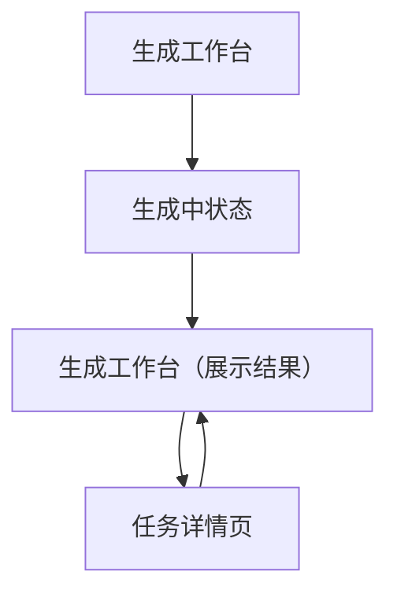

## 1. Product Overview
面向设计师/产品/开发的网页平台：你输入需求后，系统自动搜索参考图，并生成可执行的页面设计方案与要点。 
核心价值：减少“找灵感 + 写方案”的时间，把输出集中在可落地的结构与展示。

## 2. Core Features

### 2.1 Feature Module
我们的需求由以下主要页面构成：
1. **生成工作台**：需求输入、参数设置、参考图结果展示、设计方案输出与复制/下载。
2. **任务详情页**：查看单次生成的参考图与方案、分享链接。

### 2.2 Page Details
| Page Name | Module Name | Feature description |
|-----------|-------------|---------------------|
| 生成工作台 | 需求输入区 | 输入/粘贴需求文本；支持清空与示例填充；提交生成任务 |
| 生成工作台 | 生成参数 | 选择输出语言/风格倾向（如“极简/科技/企业”）；选择参考图数量；一键开始生成 |
| 生成工作台 | 任务状态与错误提示 | 展示排队/生成中/完成/失败状态；失败时展示可读错误与重试 |
| 生成工作台 | 参考图画廊 | 以网格展示参考图缩略图；支持点击放大预览；支持打开原图链接 |
| 生成工作台 | 设计方案输出 | 展示结构化方案（Markdown）；支持复制全文；支持下载为 Markdown 文件 |
| 生成工作台 | 本次结果操作 | 将本次生成保存为“任务”；生成可分享的任务链接 |
| 任务详情页 | 结果回放 | 根据任务ID加载并展示参考图与设计方案（只读） |
| 任务详情页 | 分享与导出 | 复制分享链接；复制方案；下载方案 Markdown |

## 3. Core Process
**通用用户流程**
1. 你进入“生成工作台”，在输入区填写需求（目标用户、页面类型、功能点、品牌调性等）。
2. 你设置生成参数（风格、参考图数量等），点击“开始生成”。
3. 系统先抓取并整理参考图片列表，再生成设计方案文本。
4. 你在同一页面查看参考图画廊与设计方案，必要时复制/下载。
5. 你选择“保存为任务”，获得任务详情页链接；后续可通过链接再次打开查看。

