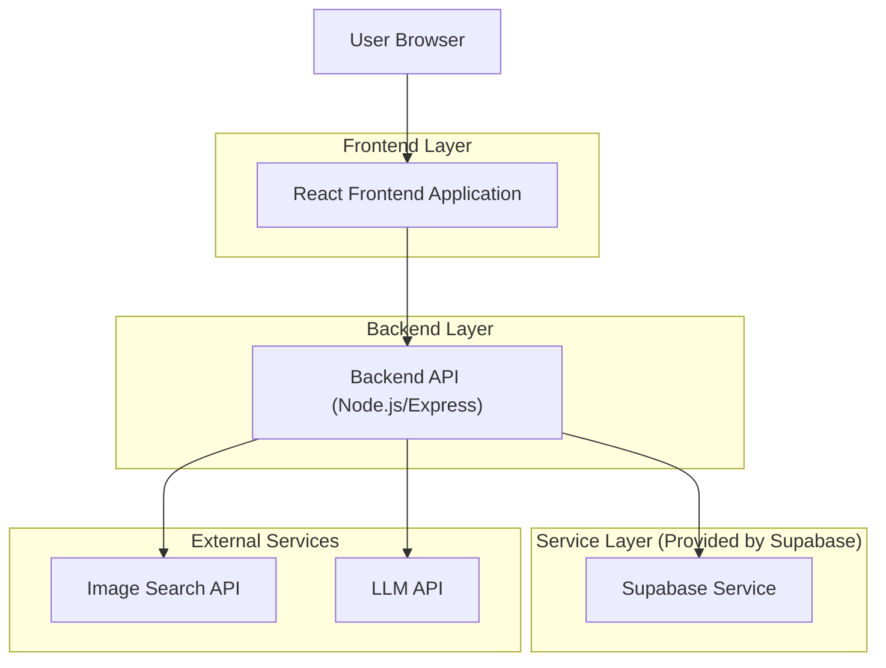
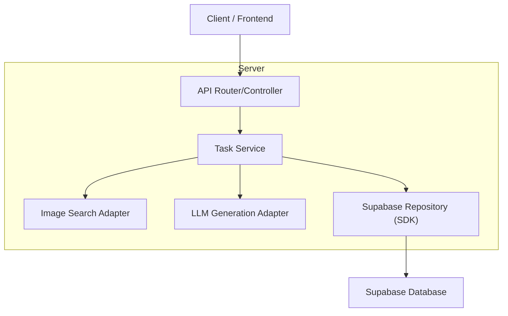
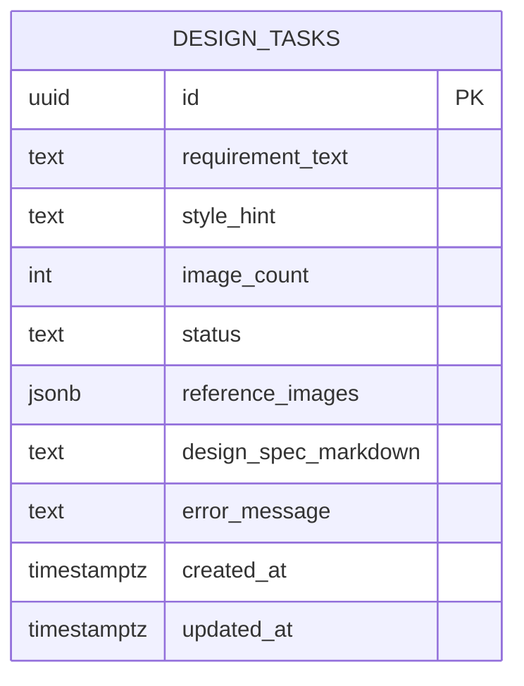

## 1.Architecture design


## 2.Technology Description
- Frontend: React@18 + vite + tailwindcss@3（Markdown 渲染组件用于方案展示）
- Backend: Node.js + Express（统一代理图片搜索与大模型生成，避免前端暴露 API Key）
- Database: Supabase（PostgreSQL，用于持久化任务与分享链接）

## 3.Route definitions
| Route | Purpose |
|-------|---------|
| / | 生成工作台：提交需求、查看参考图与方案、保存任务 |
| /tasks/:id | 任务详情页：回放单次生成结果并分享 |

## 4.API definitions (If it includes backend services)

### 4.1 TypeScript types
```ts
type DesignTaskStatus = "queued" | "running" | "succeeded" | "failed";

type ReferenceImage = {
  url: string;
  title?: string;
  source?: string;
  thumbnailUrl?: string;
};

type DesignTask = {
  id: string; // uuid
  requirementText: string;
  styleHint?: string;
  imageCount: number;
  status: DesignTaskStatus;
  referenceImages: ReferenceImage[];
  designSpecMarkdown: string;
  errorMessage?: string;
  createdAt: string; // ISO
};
```

### 4.2 Core API
#### Create task
```
POST /api/tasks
```
Request:
| Param Name| Param Type | isRequired | Description |
|----------|------------|-----------|-------------|
| requirementText | string | true | 你的需求原文 |
| styleHint | string | false | 风格倾向（如“极简/科技/企业”） |
| imageCount | number | true | 参考图数量 |

Response:
| Param Name| Param Type | Description |
|----------|------------|-------------|
| taskId | string | 任务ID |

#### Get task
```
GET /api/tasks/:id
```
Response: `DesignTask`

> 备注：图片搜索 API Key 与 LLM API Key 必须放在后端环境变量中，不在前端暴露。

## 5.Server architecture diagram (If it includes backend services)


## 6.Data model(if applicable)

### 6.1 Data model definition


### 6.2 Data Definition Language
Design Tasks Table (design_tasks)
```
CREATE TABLE design_tasks (
  id UUID PRIMARY KEY DEFAULT gen_random_uuid(),
  requirement_text TEXT NOT NULL,
  style_hint TEXT,
  image_count INTEGER NOT NULL DEFAULT 6,
  status TEXT NOT NULL DEFAULT 'queued',
  reference_images JSONB NOT NULL DEFAULT '[]'::jsonb,
  design_spec_markdown TEXT NOT NULL DEFAULT '',
  error_message TEXT,
  created_at TIMESTAMPTZ NOT NULL DEFAULT NOW(),
  updated_at TIMESTAMPTZ NOT NULL DEFAULT NOW()
);

CREATE INDEX idx_design_tasks_created_at ON design_tasks(created_at DESC);

-- Permissions (early MVP, public read for link-based access)
GRANT SELECT ON design_tasks TO anon;
GRANT ALL PRIVILEGES ON design_tasks TO authenticated;
```
