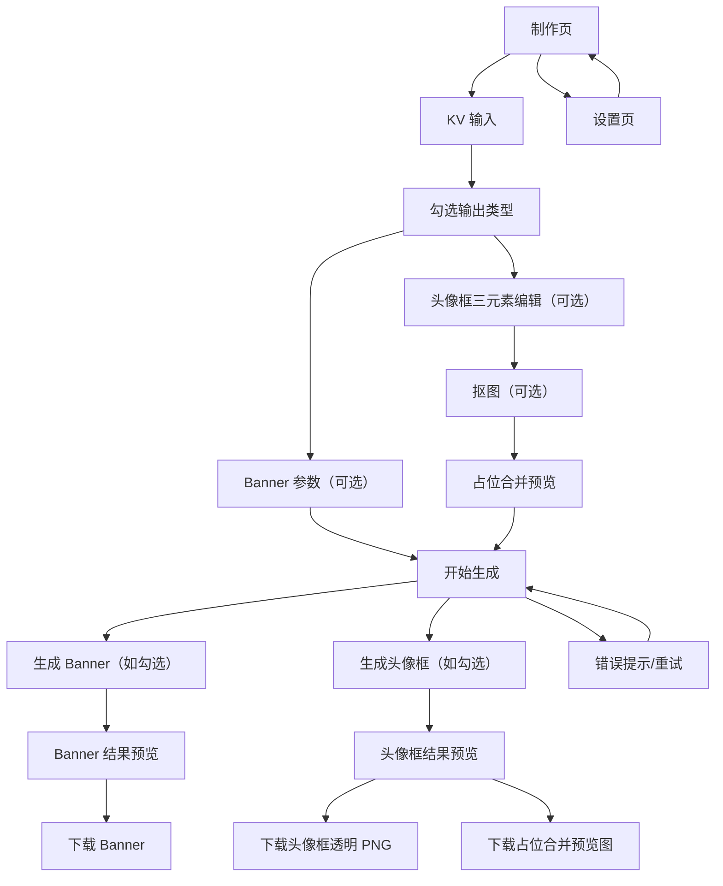

## 1. Product Overview
一个面向运营/设计同学的轻量网页工具：基于一次 KV 输入，可并行生成 Banner 与头像框。
你可以在同一制作流程里勾选输出类型，并对头像框进行三元素编辑、抠图与占位合并预览后下载。

## 2. Core Features

### 2.1 Feature Module
本工具由以下核心页面组成：
1. **制作页**：KV 输入、勾选生成 Banner/头像框、头像框三元素编辑与抠图、触发生成、预览与下载。
2. **设置页**：配置与校验生图 API Key（不硬编码）、选择/填写 API Endpoint（可选）。

### 2.2 Page Details
| Page Name | Module Name | Feature description |
|-----------|-------------|---------------------|
| 制作页 | 顶部导航 | 在“制作/设置”之间切换；显示当前 API 配置状态（已配置/未配置）。 |
| 制作页 | KV 输入 | 上传 KV 主图（拖拽/点击选择）；校验文件类型与大小；展示预览与基础信息（尺寸/文件名）。 |
| 制作页 | 输出类型勾选 | 勾选“生成 Banner / 生成头像框”（可同时勾选）；根据勾选动态显示对应参数与结果区。 |
| 制作页 | Banner 参数 | 固定展示目标尺寸 `3000×800`（只读）；选择扩图方式（以所选 API 支持为准）；输入补充描述（可选）。 |
| 制作页 | 头像框编辑-三元素 | 提供三元素编辑区：元素 1（头像框主体）、元素 2（装饰/角标）、元素 3（文案/Logo）。支持对每个元素进行：上传/替换、显隐、位置/缩放/旋转的基础调整；支持重置到默认。 |
| 制作页 | 头像框编辑-抠图 | 对头像/主体素材执行抠图（用于预览合成）；抠图失败时给出错误提示与重试入口。 |
| 制作页 | 头像框编辑-合并占位 | 提供“占位头像”（默认圆形示意图或用户上传头像）并与头像框合并生成预览图；允许切换占位头像以验证效果。 |
| 制作页 | 生成控制 | 点击“开始生成”：按勾选项分别生成 Banner 与/或头像框；未配置 API Key 时阻止生成并引导去设置；展示生成中状态与失败重试。 |
| 制作页 | 结果展示 | 分区或 Tab 展示 Banner 结果与头像框结果：空态/生成中/成功/失败；支持放大预览。 |
| 制作页 | 下载 | Banner：下载结果图；头像框：下载“头像框透明 PNG（仅框）”与“占位合并预览图（用于验收/展示）”。 |
| 设置页 | API Key 配置 | 输入/保存/清除 API Key；本地持久化保存（例如浏览器本地存储）；不在代码中写死 Key。 |
| 设置页 | 连接与校验 | 提供“测试连接”按钮：用最小请求验证 Key 可用性；展示通过/失败原因（如 401/配额不足/跨域）。 |
| 设置页 | API Endpoint（可选） | 填写或选择生图 API 的 Base URL/Endpoint（默认空，需用户配置）；用于适配不同供应商或自建网关。 |

## 3. Core Process
**用户主流程**
1. 进入制作页，上传 KV 主图。
2. 勾选需要生成的输出：Banner、头像框或两者同时。
3. 若勾选 Banner：确认目标尺寸为 3000×800，按需填写扩图方式/补充描述。
4. 若勾选头像框：完成三元素素材上传与基础调整；按需对头像/主体素材执行抠图；使用占位头像合并预览确认视觉效果。
5. 点击“开始生成”，系统按勾选项调用对应生成能力；生成失败可重试且参数不丢失。
6. 生成成功后分别预览与下载：Banner 成品；头像框透明 PNG 与占位合并预览图。

