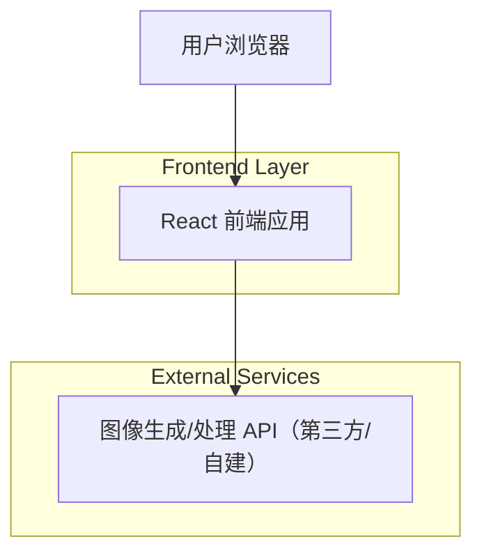

## 1.Architecture design

## 2.Technology Description
- Frontend: React@18 + vite + TypeScript + tailwindcss@3
- Backend: None（前端直接调用图像生成/处理 API；API Key 由你在设置页配置并仅本地保存，不在代码中硬编码）

## 3.Route definitions
| Route | Purpose |
|-------|---------|
| / | 制作页：KV 输入、勾选生成 Banner/头像框、头像框三元素编辑/抠图/占位合并预览、生成与下载 |
| /settings | 设置页：配置/校验 API Key 与 API Endpoint |

## 6.Data model(if applicable)
不需要数据库。API Key 仅作为你的本地配置存储于浏览器（例如 localStorage），不随应用代码发布。