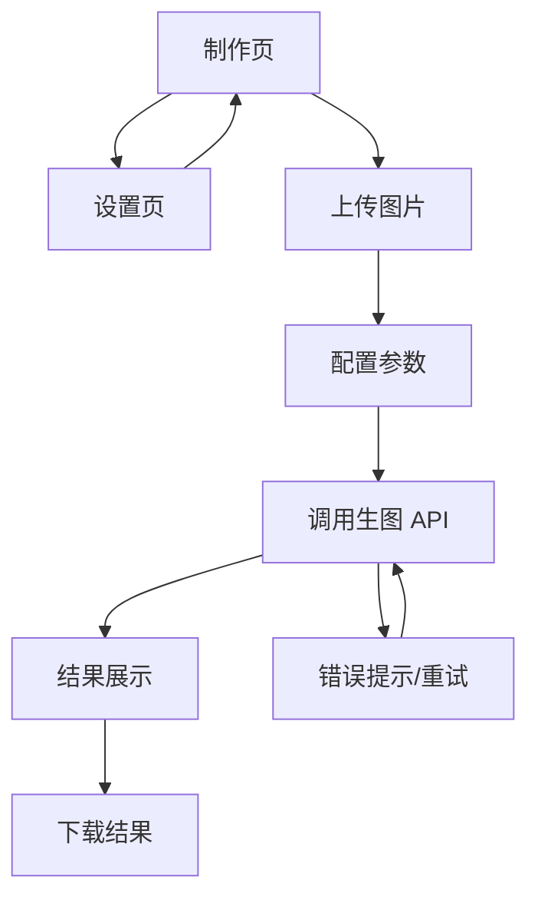

## 1. Product Overview
一个用于“上传头图并一键扩图为 3000x800 Banner”的轻量网页工具。
面向需要快速制作横幅图的运营/设计/开发人员，支持上传、调用生图 API、预览与下载结果。

## 2. Core Features

### 2.1 Feature Module
本工具由以下核心页面组成：
1. **制作页**：上传图片、配置扩图参数、触发生图、展示结果、下载结果。
2. **设置页**：配置与校验生图 API Key（不硬编码）、选择 API Endpoint（可选）。

### 2.2 Page Details
| Page Name | Module Name | Feature description |
|-----------|-------------|---------------------|
| 制作页 | 顶部导航 | 在“制作/设置”之间切换；显示当前 API 配置状态（已配置/未配置）。 |
| 制作页 | 图片上传 | 上传头图（拖拽/点击选择）；校验文件类型与大小；展示原图预览与基础信息（尺寸/文件名）。 |
| 制作页 | 生图参数 | 设定目标尺寸固定为 3000x800；选择扩图方式（如：左右扩展/上下扩展/智能补全——以所选 API 支持为准）；输入简短补充描述（可选）。 |
| 制作页 | 调用生图 API | 点击“生成 Banner”；在未配置 API Key 时阻止生成并引导去设置；展示生成中状态（loading、进度提示文案）；生成失败时展示错误信息与重试入口。 |
| 制作页 | 结果展示 | 展示生成后的 3000x800 结果图；支持放大预览（新窗口或弹层）；显示生成耗时与返回的基础元信息（若 API 提供）。 |
| 制作页 | 结果下载 | 一键下载结果图（默认 PNG/JPG 以 API 返回为准）；下载文件名包含时间戳与尺寸（例如 banner_3000x800_YYYYMMDD-HHmmss）。 |
| 设置页 | API Key 配置 | 输入/保存/清除 API Key；本地持久化保存（例如浏览器本地存储）；不在代码中写死 Key。 |
| 设置页 | 连接与校验 | 提供“测试连接”按钮：用最小请求验证 Key 可用性；展示通过/失败原因（如 401/配额不足/跨域）。 |
| 设置页 | API Endpoint（可选） | 填写或选择生图 API 的 Base URL/Endpoint（默认空，需用户配置）；用于适配不同供应商或自建网关。 |

## 3. Core Process
**用户主流程**
1. 进入制作页，上传头图。
2. 若未配置 API Key，跳转到设置页录入并保存 Key，然后返回制作页。
3. 在制作页确认目标尺寸为 3000x800，按需填写补充描述/扩图方式。
4. 点击“生成 Banner”，系统调用生图 API 并展示生成中状态。
5. 生成成功后展示结果图，用户预览确认。
6. 用户点击“下载”，保存生成的 3000x800 Banner 到本地。

