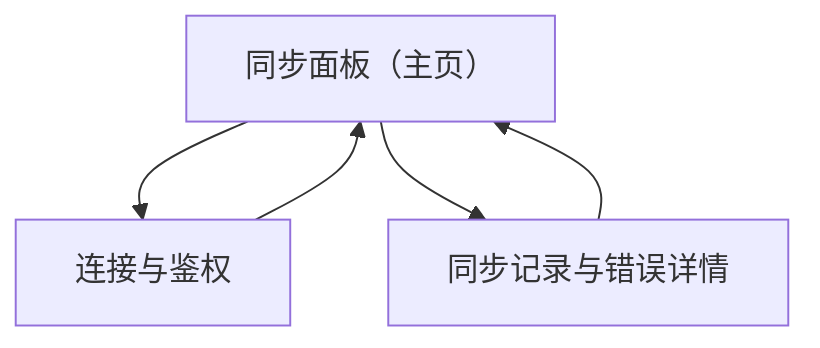

## 1. Product Overview
在 Figma 内提供一个插件，把你选中的 Page / Frame / 组件实例导出的素材与结构，一键同步到你现有的 CMS。  
核心价值：减少设计→运营/内容上架的手工导出、命名、上传与对齐成本。

## 2. Core Features

### 2.1 User Roles
| 角色 | 获取方式 | 核心权限 |
|------|----------|----------|
| 插件使用者（设计/运营） | 在 Figma 里运行插件并完成 CMS 鉴权 | 可读取当前文件中选中的 Page/Frame；可向 CMS 写入/更新素材与元数据 |
| CMS 管理员（可选） | 在 CMS 侧配置 API 权限/应用 | 可创建/发放 Token 或 OAuth 应用；配置素材库/栏目权限 |

### 2.2 Feature Module
本插件需求由以下主要页面（插件内视图）组成：
1. **连接与鉴权**：选择 CMS 环境、完成登录/Token 绑定、连接测试、断开与清除本地凭证。
2. **同步面板（主页）**：识别当前选区（Page/Frame）、选择同步目标（站点/空间/栏目/文件夹）、导出配置、开始同步、进度与结果摘要。
3. **同步记录与错误详情**：查看最近同步任务、逐项资源状态、失败原因与重试。

### 2.3 Page Details
| Page Name | Module Name | Feature description |
|---|---|---|
| 连接与鉴权 | CMS 环境配置 | 选择/输入 CMS Base URL（如生产/测试），保存为工作区配置。 |
| 连接与鉴权 | 鉴权方式 | 以「Personal Access Token（PAT）/API Token」为默认；如 CMS 仅支持 OAuth，则引导外部浏览器授权并回填 token。 |
| 连接与鉴权 | 连接测试 | 调用 CMS 的“当前用户/健康检查”接口验证 token 有效、权限足够、记录可读错误。 |
| 连接与鉴权 | 凭证管理 | 在 Figma 本地安全存储（clientStorage）保存 token；支持手动清除/更换。 |
| 同步面板（主页） | 选区识别 | 读取你当前选中的 Page/Frame/节点列表；不合法选区时提示可操作的选择方式。 |
| 同步面板（主页） | 目标选择 | 拉取并选择 CMS 目标位置（如站点/空间/栏目/文件夹/集合）；支持手动刷新。 |
| 同步面板（主页） | 导出与命名规则 | 配置导出格式（PNG/SVG/PDF/原尺寸@2x 等，按 CMS 约束裁剪/压缩）；默认命名=Figma 节点名；可启用“同名覆盖/创建副本”。 |
| 同步面板（主页） | 素材与元数据打包 | 生成同步批次：包含资源文件（blob）+ 元数据（节点路径、尺寸、时间戳、Figma fileKey、nodeId）。 |
| 同步面板（主页） | 同步执行与进度 | 分步执行（预检→导出→上传→写入 CMS 记录→校验）；展示进度条、当前项、成功/失败计数；支持取消。 |
| 同步记录与错误详情 | 任务列表 | 按时间展示最近 N 次同步：目标、选区摘要、耗时、成功率、版本号。 |
| 同步记录与错误详情 | 逐项状态 | 展示每个素材/节点的状态（已创建/已更新/跳过/失败）、CMS 返回的 assetId、重试按钮。 |
| 同步记录与错误详情 | 错误诊断与处理 | 展示错误码、可读原因、建议动作（重新鉴权/降低导出尺寸/检查权限/稍后重试）；提供导出日志（JSON）。 |

## 3. Core Process
### 插件使用者流程
1) 你在 Figma 中选中要同步的 Page 或 Frame（或多选 Frame）。
2) 打开插件，如未连接 CMS：进入“连接与鉴权”完成 token 绑定并测试连接。
3) 回到“同步面板”，插件读取选区并提示将导出的资源数量与类型。
4) 你选择 CMS 目标位置与导出规则（格式、倍图、覆盖策略）。
5) 点击“开始同步”，插件执行预检：鉴权、目标可写权限、预计体积是否超限。
6) 插件导出素材并按批次上传，随后在 CMS 创建/更新素材记录并绑定元数据。
7) 同步完成后显示摘要；如有失败，你可在“同步记录与错误详情”中查看原因并重试失败项。

### 错误处理原则（贯穿流程）
- 鉴权失败：立即中断并引导重新连接，不继续导出与上传。
- 部分失败：批次内逐项隔离失败项，成功项保留；失败项可重试。
- 冲突（同名/同路径已存在）：按你的覆盖策略执行（覆盖/创建副本/跳过），并记录决策。
- 网络/超时/限流：指数退避重试（有上限），并把最终错误写入任务日志。

