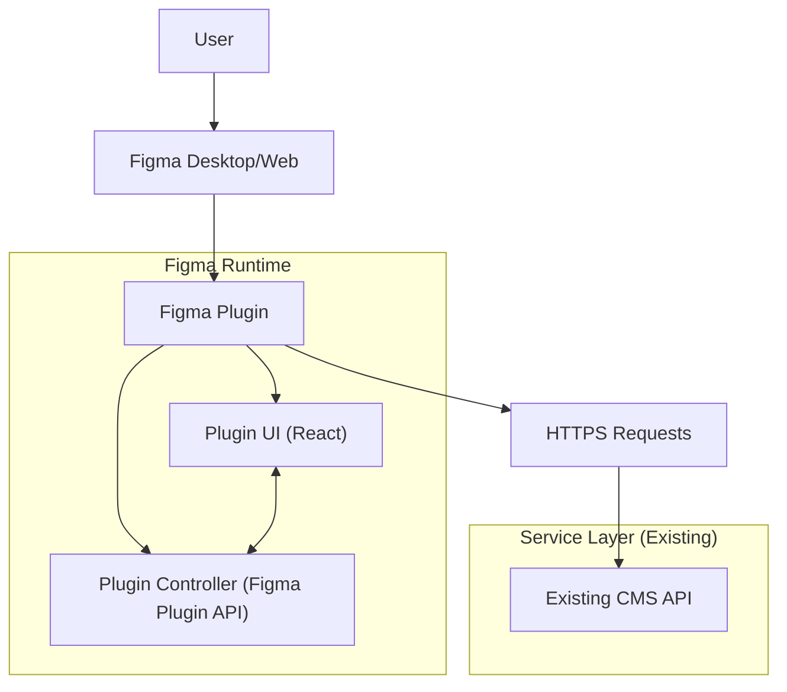

## 1.Architecture design


## 2.Technology Description
- Frontend (Plugin UI): React@18 + TypeScript + vite + tailwindcss@3
- Plugin Runtime: Figma Plugin API（controller 与 UI 通过 postMessage 通信）
- Backend: None（直接对接现有 CMS API）

## 3.Route definitions
| Route | Purpose |
|---|---|
| /connect | 连接与鉴权视图：配置 Base URL、录入/更新 token、连接测试、清除凭证 |
| /sync | 同步面板：选区识别、目标选择、导出设置、开始同步、进度与结果摘要 |
| /logs | 同步记录：任务列表、逐项状态、错误详情、失败项重试 |

## 4.API definitions (CMS Integration Contract)
> 由于你现有 CMS 的真实接口未给出，这里定义**插件侧需要的最小 API 契约**（你可映射到现有接口或加一层兼容适配）。

### 4.1 Shared TypeScript types
```ts
export type CmsEnv = { baseUrl: string; name: string };

export type AuthMethod = "pat" | "oauth";

export type CmsAuth = {
  method: AuthMethod;
  accessToken: string; // PAT 或 OAuth access token
  expiresAt?: string; // ISO8601，可选
};

export type ExportFormat = "png" | "svg" | "pdf";

export type AssetMeta = {
  figmaFileKey: string;
  figmaNodeId: string;
  figmaNodePath: string; // 例如 "Page/Frame/Button"
  name: string;
  width: number;
  height: number;
  format: ExportFormat;
  scale: number; // 1/2 等
  updatedAt: string; // 插件生成的 ISO8601
};

export type AssetItem = {
  meta: AssetMeta;
  contentSha256: string; // 用于去重/幂等
  bytes: number;
  mimeType: string;
};

export type SyncJob = {
  jobId: string; // UUID
  target: { spaceId?: string; folderId?: string; collectionId?: string };
  overwriteStrategy: "overwrite" | "duplicate" | "skip";
  items: AssetItem[];
  createdAt: string;
};

export type SyncItemResult = {
  figmaNodeId: string;
  status: "created" | "updated" | "skipped" | "failed";
  assetId?: string;
  error?: { code: ErrorCode; message: string; retriable: boolean };
};

export type SyncResult = {
  jobId: string;
  summary: { total: number; success: number; failed: number; skipped: number };
  results: SyncItemResult[];
};

export type ErrorCode =
  | "AUTH_INVALID"
  | "AUTH_EXPIRED"
  | "PERMISSION_DENIED"
  | "TARGET_NOT_FOUND"
  | "PAYLOAD_TOO_LARGE"
  | "RATE_LIMITED"
  | "NETWORK_TIMEOUT"
  | "CONFLICT"
  | "UNSUPPORTED_FORMAT"
  | "UNKNOWN";
```

### 4.2 Core API (Recommended)
#### 获取当前身份/连通性（用于连接测试）
```
GET /api/me
Authorization: Bearer <token>
```
Response (200):
```json
{ "id": "u_123", "name": "Alice", "scopes": ["assets:read","assets:write"] }
```

#### 获取目标列表（空间/栏目/文件夹/集合，按你的 CMS 概念映射）
```
GET /api/spaces
GET /api/spaces/{spaceId}/folders
GET /api/collections
```

#### 上传文件（两种二选一）
A) 直传：
```
POST /api/assets/upload
Content-Type: multipart/form-data
Authorization: Bearer <token>
```
Response:
```json
{ "uploadId": "up_123", "url": "https://cdn/.../file.png" }
```

B) 预签名上传（推荐大文件/直传对象存储）：
```
POST /api/uploads/presign
```
Request:
```json
{ "filename": "Button.png", "mimeType": "image/png", "bytes": 12345, "sha256": "..." }
```
Response:
```json
{ "uploadId": "up_123", "putUrl": "https://...", "publicUrl": "https://..." }
```

#### 创建/更新素材记录（幂等建议：以 figmaFileKey+figmaNodeId 或 sha256 作为唯一键）
```
POST /api/assets
PUT /api/assets/{assetId}
```
Request（最小字段）：
```json
{
  "target": { "spaceId": "s1", "folderId": "f1" },
  "name": "Button",
  "source": { "figmaFileKey": "...", "figmaNodeId": "...", "figmaNodePath": "Page/Frame/Button" },
  "file": { "uploadId": "up_123", "url": "https://...", "mimeType": "image/png", "bytes": 12345, "sha256": "..." },
  "meta": { "width": 120, "height": 40, "format": "png", "scale": 2 }
}
```

## 5.Server architecture diagram (If it includes backend services)
不适用（插件直接对接现有 CMS；如你必须隐藏 OAuth client_secret，才需要额外的授权回调/签名代理服务）。

## 6.Data model(if applicable)
不适用（数据库由现有 CMS 持有；插件侧仅维护本地任务日志与 token）。

### 同步流程与错误处理（实现要点）
- 预检：/api/me 校验；并校验目标可写权限与导出参数（格式、体积阈值）。
- 分段与并发：对 items 分批（例如 5~10 个/批）上传；并发受控，遇到 429 触发退避。
- 幂等：写入 CMS 时附带 source( figmaFileKey+nodeId ) 或 sha256，服务端可返回已存在 assetId 以走 update/skip。
- 错误映射：HTTP 401/403→AUTH/PERMISSION；404→TARGET_NOT_FOUND；413→PAYLOAD_TOO_LARGE；429→RATE_LIMITED；timeout→NETWORK_TIMEOUT；其余→UNKNOWN，并记录原始 response。
- 重试策略：仅对 retriable 错误（429/timeout/5xx）重试；对内容类错误（格式不支持/超限/权限不足）不重试。
