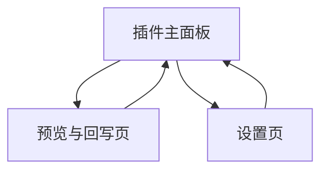

## 1. Product Overview
面向设计师的 Figma 插件：将选中的 Frame/Group 导出为 KV 描述，调用现有生成服务产出「三元素 + 合成」，并回写为按图层拆分的头像框 Frame。
帮助你在 Figma 内完成从版式到可编辑分层素材的自动化生产，减少重复拆图与排版。

## 2. Core Features

### 2.1 User Roles
| 角色 | 注册/登录方式 | 核心权限 |
|------|--------------|----------|
| 设计师（插件用户） | 无（使用 Figma 登录态） | 选择图层、导出 KV、发起生成、预览结果、回写为分图层头像框 Frame、配置服务参数 |

### 2.2 Feature Module
本插件需求由以下页面组成：
1. **插件主面板**：选择校验、导出 KV、生成参数、发起生成、进度/日志、任务历史。
2. **预览与回写页**：三元素与合成预览、图层映射与命名、回写范围选择、回写执行与回滚。
3. **设置页**：生成服务地址与鉴权配置、默认参数、连通性测试、存储与重置。

### 2.3 Page Details
| Page Name | Module Name | Feature description |
|-----------|-------------|---------------------|
| 插件主面板 | 选择与校验 | 读取当前选中节点；限制仅支持 Frame/Group；提示不符合条件原因（为空/多选/类型不支持/含组件实例等）。 |
| 插件主面板 | KV 导出 | 将选中节点的布局/尺寸/层级/样式（颜色、圆角、描边、文本样式、图片填充等）导出为 KV 结构；支持复制到剪贴板与下载 JSON（可选其一，至少提供复制）。 |
| 插件主面板 | 生成参数 | 配置本次生成的目标规格（头像框尺寸、出图比例、主题/风格、是否生成三元素、是否生成合成、数量=1 等）；提供参数校验与默认值。 |
| 插件主面板 | 发起生成与进度 | 调用既有生成服务提交 KV 与参数；展示排队/生成/失败状态与耗时；提供取消/重试。 |
| 插件主面板 | 任务历史 | 记录最近 N 次任务（时间、输入节点名、状态、结果摘要）；支持点击进入「预览与回写页」。 |
| 预览与回写页 | 结果展示 | 分区展示「三元素」（如：主体/装饰/文字）与「合成图」的缩略图与全屏预览；支持下载单张。 |
| 预览与回写页 | 图层映射与命名 | 允许你为三元素与合成指定图层名规则（前缀/序号/原节点名）；当服务返回分层信息时展示映射结果并允许调整。 |
| 预览与回写页 | 回写配置 | 选择回写目标位置（当前页面/新建页面/新建 Frame 容器）；选择回写形式（分图层头像框 Frame：每个元素一个图层/子 Frame，并保持合成参考图）。 |
| 预览与回写页 | 回写与回滚 | 在 Figma 画布创建头像框 Frame（尺寸=目标规格）；写入三元素与合成（作为图层或子 Frame）；生成后自动聚焦定位；提供“一键回滚”删除本次写入内容。 |
| 预览与回写页 | 错误处理 | 对服务失败/返回缺字段/图片下载失败给出可操作提示（重试、返回主面板、查看错误详情）。 |
| 设置页 | 服务配置 | 配置生成服务 Base URL、鉴权（Token/Key）与超时；本地保存并在启动时加载。 |
| 设置页 | 默认参数 | 设置默认头像框尺寸、命名规则、是否生成三元素/合成等默认值，用于主面板快速发起。 |
| 设置页 | 连接测试与重置 | 发起健康检查/鉴权校验并展示结果；支持清空本地配置并恢复默认。 |

## 3. Core Process
- 你在画布中选中一个 Frame/Group，打开插件主面板。
- 插件校验选中内容后，将其导出为 KV，并基于你的参数调用生成服务创建任务。
- 生成完成后，你进入预览与回写页查看三元素与合成结果，必要时调整图层命名/映射与回写位置。
- 你点击回写，插件在画布中新建「分图层头像框 Frame」，把三元素与合成分别写入为可编辑图层；如不满意可一键回滚。
- 需要更换服务或默认参数时，你进入设置页完成配置并返回主面板继续使用。

