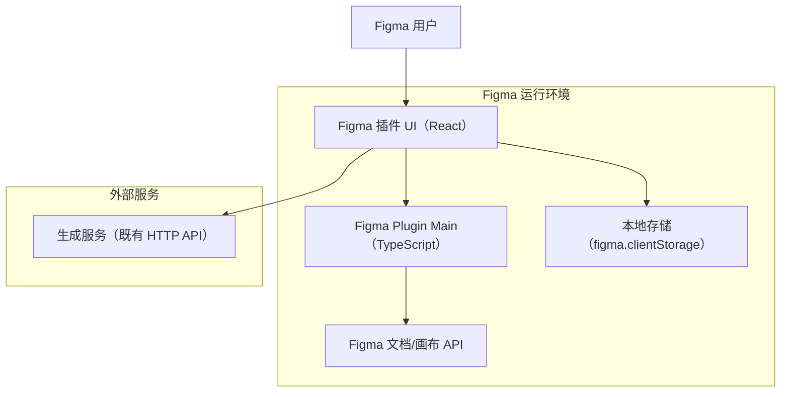

## 1.Architecture design

## 2.Technology Description
- Frontend（插件 UI）: React@18 + TypeScript + Vite（Figma plugin UI iframe）
- Backend: None（默认由插件直接调用既有生成服务）
- Storage: figma.clientStorage（保存服务地址、Token、默认参数与任务历史摘要）

> 安全说明：若生成服务鉴权 Token 属于“不可下发到客户端的密钥”，建议增加一个你方的轻量代理（如公司网关/Serverless）代为签名与转发；否则可由用户在设置页填写个人 Token 并存本地。

## 3.Route definitions
| Route | Purpose |
|-------|---------|
| / | 插件主面板：选择校验、KV 导出、发起生成、查看任务历史 |
| /preview/:taskId | 预览与回写页：展示三元素与合成、配置回写与执行回写 |
| /settings | 设置页：配置生成服务与默认参数、连通性测试 |
